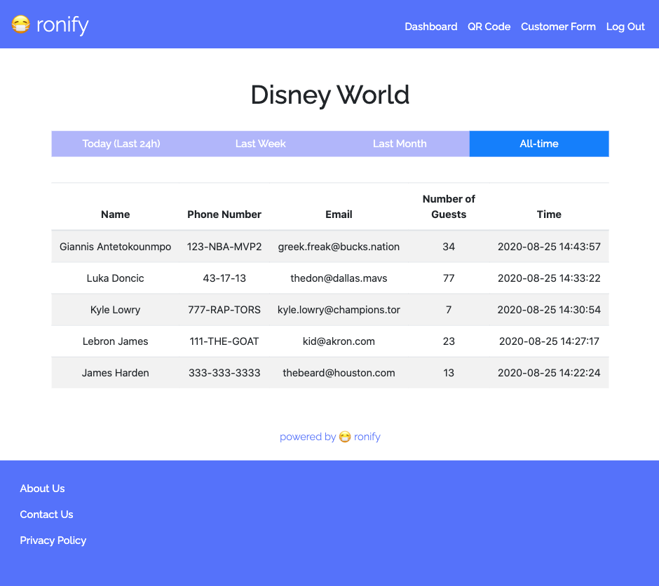
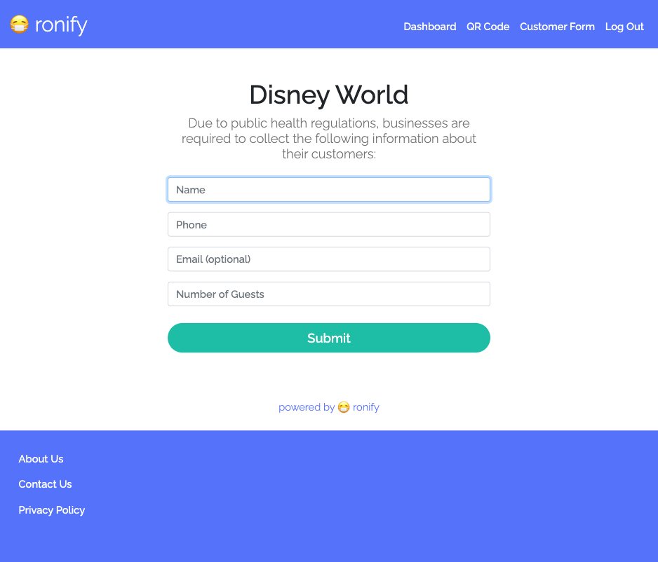

# Ronify

Maintain your customer logs without the need for pen and paper!

Created by Daniel Ye and Joshua Ye in the summer of 2020.

In Toronto, Canada, small businesses, such as restaurants and beauty salons, are required by law to record their customers' names and phone numbers due to the COVID-19 pandemic.
Traditionally, business owners would manually write down this information.

Ronify simplifies this process through a web application that allows customers to fill their personal information on their own devices.
When businesses register on our website, Ronify generates a unique, printable QR code, which can be placed at the entrance of their business for customers to scan.
If a customer does not have internet or a phone, staff can access a webform on their own device for the customer to submit.

Once the form is entered, the customer's data is displayed to the business' dashboard upon login.
This important information can be sorted to show data entries from the last 24 hours, last week, last month, or all-time.

By tracking this data, Ronify enables small businesses to safely monitor their customer history and relay it to authorities in the case of an outbreak.

In the development of Ronify, we used Python and the Flask framework for back-end, and for front-end we used HTML, CSS, and Javascript. We also used MySQL as our database and Figma for designing.

Feel free to check us out our updated site at https://ronify.me/

## Landing Page

## Instructions

## Dashboard

## QR Code

## Form

